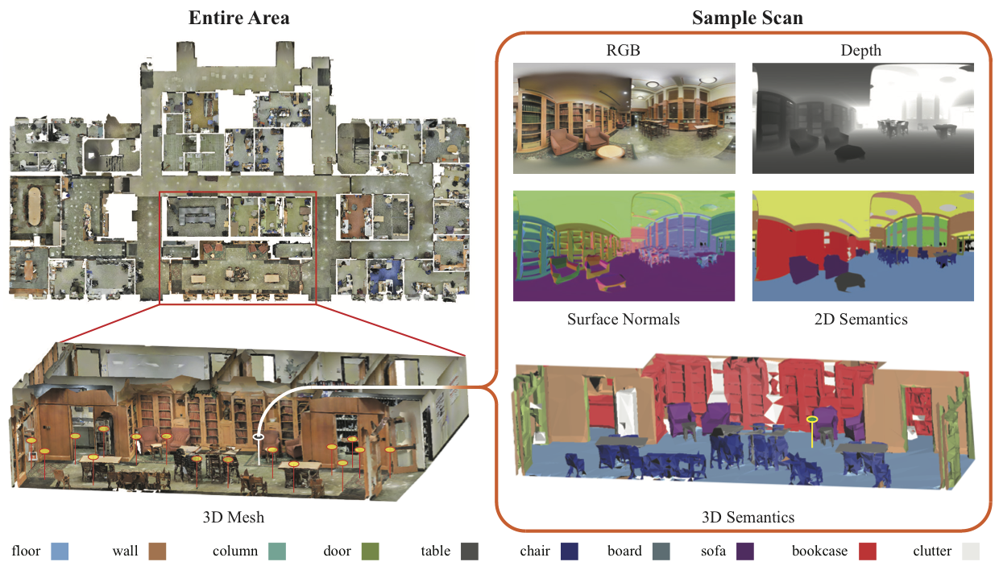
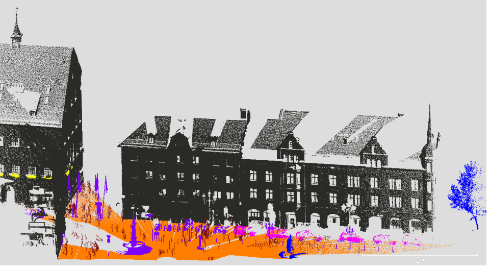
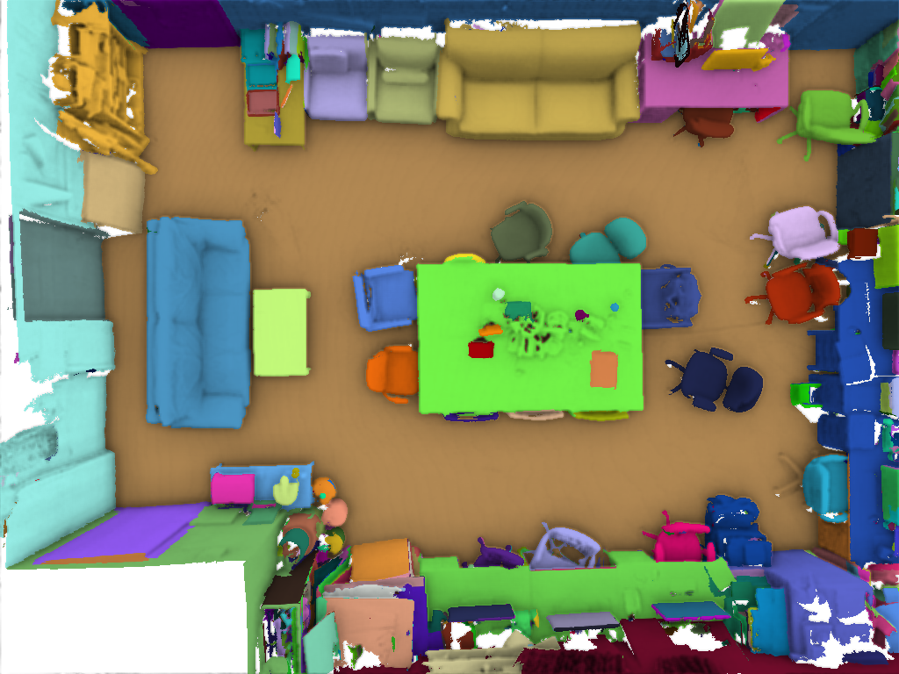
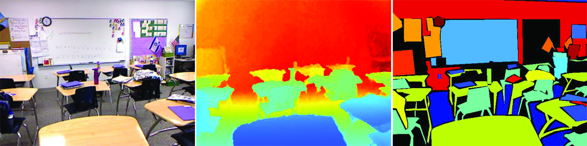
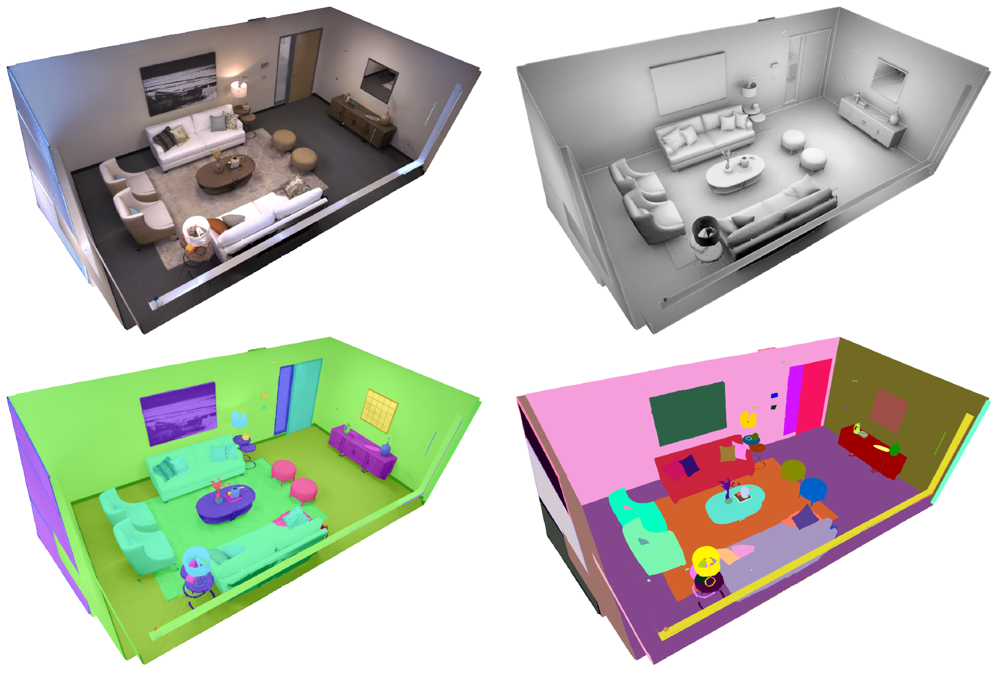

# 3D Dataset

## Overview

| Dataset                   | 内容(格式*)   | 场景/部件数 | 图片数         | 类别数 | 语义 | 实例 | 部件 | 已下载 |
| ------------------------- | ------------- | ----------- | -------------- | ------ | ---- | ---- | ---- | ------ |
| [S3DIS/2D-3D-S](#S3DIS)   | indoor (MDIP) | 6           | 70,496 (1,413) | 13     | ✓    | ✓    |      | ✓      |
| [Semantic3D](#Semantic3D) | urban (IP)    |             |                | 8      | ✓    |
| [SemanticKITTI](#KITTI)   |
| [ScanNet](#ScaneNet)      |               | 1513        |
| [ShapeNet](#ShapeNet)     | shapes (M)    | 31,963      |
| NYUv1                     |
| [NYUv2](#NYUv2)           | Indoor (ID)   | 1449        |                | 894    |      | ✓    |      |        |
| SUN RGB-D                 |               | 10K         |
| [SceneNN](#SceneNN)       | indoor (MID)  | 100         |                | 22     |      | ✓    |      | ✓      |
| RueMonge2014              |
| Semantic3D                |
| PL3D                      |
| Matterport3D              |
| HM3DSem                   | indoor        | 216         |                | 106    |      |      |      |        |
| HoME                      |               |
| House3D                   |
| [PSB](#PSB)               |
| [COSEG](#COSEG)           |               | 180         |                | 8      |      |      | ✓    | ✓      |
| [UDA_Part](#UDA_Part)     |               | 21          |                | 6      |      |      | ✓    | ✓      |
| ShapeNet-Part             |               | 15,776      |                | 16     |      |      | ✓    | ✓      |
| [PartNet](#PartNet)       |               | 5,662       |                | 4      |      |      | ✓    | ✓      |
| TUM                       |               | 47          |
| RGBD-v2                   |               | 17          |
| SUN 3D                    |               | 254         |
| Paris-CARLA-3D            | Outdoor(P)    |             |                |        | ✓    | ✓    |      |        |
| [Replica](#Replica)       | Indoor (M)    | 18          |                | 88     | ✓    | ✓    |      | ✓      |
| HM3D(#HM3D)               | Indoor        | 1000        |                |        |      |      |      |        |

*格式: M: Mesh, D: Depth, I: Images, P: Point Clouds

## 1. S3DIS

S3DIS dataset, the complete point clouds are obtained without any manual intervention using the Matterport scanner. The dataset consists of 271 rooms belonging to 6 large-scale indoor scenes from 3 different buildings (total of 6020 square meters). These areas mainly include offices, educational and exhibition spaces, and conference rooms etc.

- name: Stanford Large-Scale 3D Indoor Space Dataset
- [Home](http://buildingparser.stanford.edu/dataset.html)
- paper: [3D Semantic Parsing of Large-Scale Indoor Spaces](http://buildingparser.stanford.edu/images/3D_Semantic_Parsing.pdf)

### 1.1 2D-3D-S Dataset

The 2D-3D-S dataset provides a variety of mutually registered modalities from 2D, 2.5D and 3D domains, with instance-level semantic and geometric annotations. It covers over 6,000 m2 and contains over 70,000 RGB images, along with the corresponding depths, surface normals, semantic annotations, global XYZ images (all in forms of both regular and 360° equirectangular images) as well as camera information. It also includes registered raw and semantically annotated 3D meshes and point clouds. In addition, the dataset contains the raw RGB and Depth imagery along with the corresponding camera information per scan location. The dataset enables development of joint and cross-modal learning models and potentially unsupervised approaches utilizing the regularities present in large-scale indoor spaces.

In more detail, the dataset is collected in 6 large-scale indoor areas that originate from 3 different buildings of mainly educational and office use. For each area, all modalities are registered in the same reference system, yielding pixel to pixel correspondences among them. In a nutshell, the presented dataset contains a total of 70,496 regular RGB and 1,413 equirectangular RGB images, along with their corresponding depths, surface normals, semantic annotations, global XYZ OpenEXR format and camera metadata. It also contains the raw sensor data, which comprises of 18 HDR RGB and Depth images (6 looking forward, 6 towards the top, 6 towards the bottom) along with the corresponding camera metadata per each of the 1,413 scan locations, yielding a total of 25,434 RGBD raw images. In addition, we provide whole building 3D reconstructions as textured meshes, as well as the corresponding 3D semantic meshes. We also include the colored 3D point cloud data of these areas with the total number of 695,878,620 points, that has been previously presented in the Stanford large-scale 3D Indoor Spaces Dataset (S3DIS).

- [GitHub](https://github.com/alexsax/2D-3D-Semantics)
- paper: Joint 2d-3d-semantic data for indoor scene understanding, 2017

## 2. Semantic3D

Semantic3D comprises a total of around 4 billion 3D points acquired with static terrestrial laser scanners, covering up to 160×240×30 meters in real-world 3D space. Point clouds belong to 8 classes (e.g. urban and rural) and contain 3D coordinates, RGB information, and intensity. Unlike 2D annotation strategies, 3D data labeling is easily amenable to over-segmentation where each point is individually assigned to a class label.

- [Home](http://www.semantic3d.net/)
- paper: [SEMANTIC3D.NET: A new large-scale point cloud classification benchmar, 2017](https://www.ethz.ch/content/dam/ethz/special-interest/baug/igp/photogrammetry-remote-sensing-dam/documents/pdf/Papers/Hackel-etal-cmrt2017.pdf)

## 3. SemanticKITTI

SemanticKITTI is a large outdoor dataset containing detailed point-wise annotation of 28 classed. Building on the KITTI vision benchmark [32], SemanticKITTI contains annotations of all 22 sequences of this benchmark consisting of 43K scans. Moreover, the dataset contains labels for the complete horizontal 360 filed-of-view of the rotating laser sensor.

## 4. ScanNet

ScanNet dataset is particularly valuable for research in scene understanding as its annotations contain estimated calibration parameters, camera poses, 3D surface reconstruction, textured meshes, dense object level semantic segmentation, and CAD models. The dataset comprises annotated RGB-D scans of real-world environments. There are 2.5M RGB-D images in 1513 scans acquired in 707 distinct places. After RGB-D image processing, annotation HITs (Human Intelligence Tasks) were performed using the Amazon Mechanical Turk.

- paper: Scannet: Richly-annotated 3d reconstructions of indoor

## 5. ShapeNet

ShapeNet dataset has a novel scalable method for efficient and accurate geometric annotation of massive 3D shape collections. The novel technical innovations explicitly model and lessen the human cost of the annotation effort. Researchers create detailed point-wise labeling of 31963 models in shape categories in ShapeNetCore and combine feature-based classifiers, point-to-point correspondences, and shape-to-shape similarities into a single CRF optimization over the network of shapes.

### 5.1 UDA-Part/CGPart

- project https://qliu24.github.io/udapart/

### 5.2 ShapeNet-Part

- paper: A Scalable Active Framework for Region Annotation in 3D Shape Collections
- project: https://cs.stanford.edu/~ericyi/project_page/part_annotation/

### 5.3 PartNet

## 6. COSEG

- project: http://irc.cs.sdu.edu.cn/~yunhai/public_html/ssl/ssd.htm

## 7. PSB

- project https://segeval.cs.princeton.edu/

## 8. SceneNN

We introduce an RGB-D scene dataset consisting of more than 100 indoor scenes. Our scenes are captured at various places, e.g., offices, dormitory, classrooms, pantry, etc., from University of Massachusetts Boston and Singapore University of Technology and Design.
All scenes are reconstructed into triangle meshes and have per-vertex and per-pixel annotation. We further enriched the dataset with fine-grained information such as axis-aligned bounding boxes, oriented bounding boxes, and object poses.

- paper: [Scenenn: A scene meshes dataset with annotations](https://ieeexplore.ieee.org/stamp/stamp.jsp?tp=&arnumber=7785081).
- [home](https://hkust-vgd.github.io/scenenn/)

## 9.  NYUv2 

The dataset consists of 1449 RGBD images2, gathered from a wide range of commercial and residential buildings in three different US cities, comprising 464 different indoor scenes across 26 scene classes.A dense per-pixel labeling was obtained for each image using Amazon Mechanical Turk. If a scene contained multiple instances of an object class, each instance received a unique instance label, e.g. two different cups in the same image would be labeled: cup 1 and cup 2, to uniquely identify them. The dataset contains 35,064 distinct objects, spanning 894 different classes. For each of the 1449 images, support annotations were manually added. Each image’s support annotations consists of a set of 3-tuples: [Ri, Rj , type] where Riis the region ID of the supported object, Rj is the region ID of the supporting object and type indicates whether the support is from below (e.g. cup on a table) or from behind (e.g. picture on a wall). Examples of the dataset are found in Fig 7 (object category labels not shown).

- name : NYU Depth Dataset V2
- paper: [Indoor Segmentation and Support Inference from RGBD Images, ECCV 2012](https://cs.nyu.edu/~silberman/papers/indoor_seg_support.pdf)
- [Project Home](https://cs.nyu.edu/~silberman/datasets/nyu_depth_v2)

## 10.  HM3DSem 

The Habitat-Matterport 3D Semantics Dataset (HM3DSem) is the largest-ever dataset of 3D real-world and indoor spaces with densely annotated semantics that is available to the academic community. HM3DSem v0.2 consists of 142,646 object instance annotations across 216 3D-spaces from HM3D and 3,100 rooms within those spaces. The HM3D scenes are annotated with the 142,646 raw object names, which are mapped to 40 Matterport categories. On average, each scene in HM3DSem v0.2 consists of 661 objects from 106 categories. This dataset is the result of 14,200+ hours of human effort for annotation and verification by 20+ annotators.

- name: Habitat Matterport 3D Semantics Dataset
- [Project](https://aihabitat.org/datasets/hm3d-semantics/)

## 11.  Replica

The Replica Dataset is a dataset of high quality reconstructions of a variety of indoor spaces. Each reconstruction has clean dense geometry, high resolution and high dynamic range textures, glass and mirror surface information, planar segmentation as well as semantic class and instance segmentation. See the technical report for more details.

- [Project](https://github.com/facebookresearch/Replica-Dataset)
- paper: [The Replica Dataset: A Digital Replica of Indoor Spaces](https://arxiv.org/abs/1906.05797)

## 12.  HM3D 

The Habitat-Matterport 3D Research Dataset (HM3D) is the largest-ever dataset of 3D indoor spaces. It consists of 1,000 high-resolution 3D scans (or digital twins) of building-scale residential, commercial, and civic spaces generated from real-world environments.

- name: Habitat-Matterport 3D Research Dataset (HM3D)
- [Project](https://aihabitat.org/datasets/hm3d/)
- paper: [Habitat-Matterport 3D Dataset ({HM}3D): 1000 Large-scale 3D Environments for Embodied {AI}](https://arxiv.org/abs/2109.08238)

## Paris-CARLA-3D

- paper: Paris-CARLA-3D: a Real and Synthetic Outdoor Point Cloud Dataset for Challenging Tasks in 3D Mapping
- [Project Home](https://npm3d.fr/paris-carla-3d)

## Other

- [Virtual KITTI 3D Dataset for Semantic Segmentation](https://github.com/VisualComputingInstitute/vkitti3D-dataset)

# TODO

- paper: Learning to predict part mobility from a single static snapshot